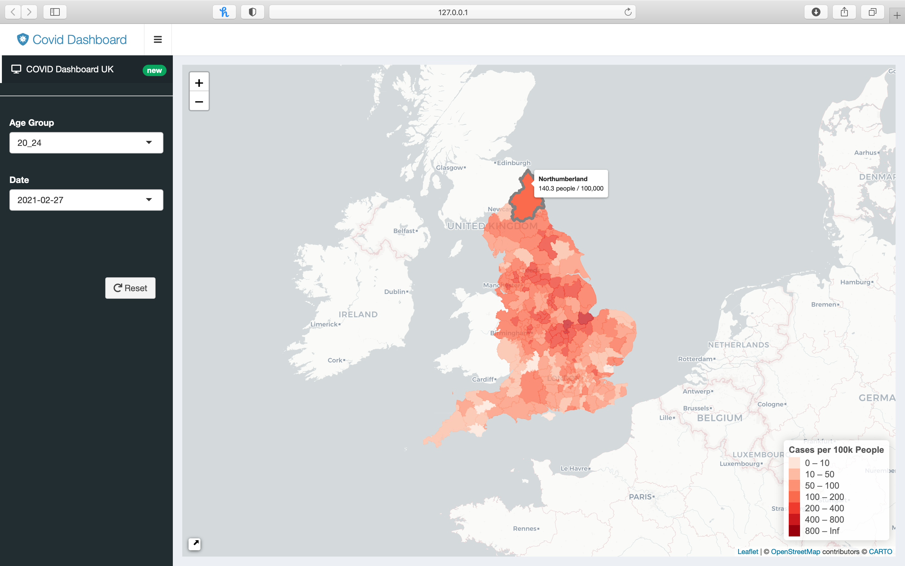

\
[GitHub repository of this project](https://github.com/intro-to-data-science-21/data-project-covid_dashboard_uk)
\
\

**Steve Kerr** downloaded Covid-19 data through the UK government’s API, wrangled data, and created the interactive map with Leaflet. \
**Kai Foerster** worked on the coding of the shiny app, the import of the shape files in the right format and assisted in downloading the covid data from the API. \
**Dominik Cramer** conducted research on creating interactive maps with leaflet, contributed smaller sections of code and drafted the project report.\
\

# Executive Summary
In this project, an interactive map showing Covid-19 incidences in England by locality, date, and age group was created. It aims at making structured information accessible and understandable for everyone during the ongoing pandemic. Most data used is provided by the UK Government on their [official website](https://coronavirus.data.gov.uk). It is combined with data on boundaries of local authority districts. This makes it possible to show incidences depending on locality, date, and age group in an interactive map which is user friendly and accessible.\
{width=85%}

# Introduction
The Covid-19 pandemic continues to be one of the most pressing problems in almost all countries around the world. Possibly the most valuable resource in this crisis is information. As our understanding of this virus and new variants increases, our responses get more and more refined.\
\
At first, many believed that SARS-CoV-2 spreads by smear infections and recommended disinfecting hands and surfaces more often. When aerosol transmission was discovered, keeping distance and wearing masks inside became common sense. During the last year, more people gained access to vaccines, reducing the risk of infection for many. Now, we are in a situation in which harsh restrictions of personal freedoms (lockdown) do not seem opportune anymore in many western countries. It is often argued that the obligation to protect against the virus has shifted away from governments towards individuals. While the accuracy of this argument can be debated, it is clear that it strongly influences political decisions in countries like the US, Germany, France, or Great Britain.\
\
Nevertheless, it should not be forgotten that individuals have limited capacities gathering information and assessing their personal risk while the pandemic situation continues to change rapidly. We know that most people do not follow the daily news and that the amount of more or less unstructured information on this pandemic is overwhelming to many, leaving some unable to distinguish between facts and fake news. If individuals are to protect themselves against this virus, structured information needs to be easily accessible and understandable for the broader public.

# Scope
This is why our group originally set out to build a model estimating an individual's risk based on their location, age, and vaccination status. Since we could not collect data ourselves, we chose to realize this project for England where a lot of Covid related data is availiable via the [Coronavirus Dashboard UK](https://coronavirus.data.gov.uk/details/interactive-map/cases). However, after our personal experience with this virus, we were forced to narrow down the scope of this project to an interactive map showing incidences in England by locality, date, and age group. We decided to use 7-day rolling averages to calculate the case rate since this corrects for daily variation throughout the week. Compared to the already existing one, our dashboard should still be a contribution to individual's ability to assess their personal risk more precisely as it adds the age dimension that accounts for large differences in the incidence.

# Data Collection
We acquired our data by pulling it from the API for the variable "New cases by specimen date age demographics" on [the official UK government website for data and insights on coronavirus (COVID-19)](https://coronavirus.data.gov.uk). This allows for a breakdown of new Covid-19 cases by age which is exactly what we needed for our dashboard. However, we quickly realized that data can only be pulled for one locality at a time. Therefore, we created a for-loop for the API call, pulling the data for each locality one after another and combining them into one single data frame. To build our map, we also needed a dataset containing the boundaries of all local authority districts in England. We found such a dataset for Great Britain [here](https://geoportal.statistics.gov.uk/datasets/local-authority-districts-december-2019-boundaries-uk-bfc-1/explore?location=55.340004%2C-3.316939%2C5.81).

# Data Wrangling
The data frame containing the data pulled from the API needed to be rectangled, i.e. converted from a nested list to a tidy data set of rows and columns. The dataset containing the boundaries of local authority districts came as a shapefile in a special British cartography format that made our map unreadable since the coordinates inside were not stored using latitude and longitude. Therefore, we had to convert this cartography format in Python using GeoPandas. Afterwards, we were able to join both datasets by merging the one containing Covid data onto the other while preserving coordinates and polygons from the former dataset. This conveniently allowed for us to remove geospacial data from any regions with no up-to-date Covid data, including Scotland, Wales, and the very center of London.

# Building the Map
Our map is supposed to be an intuitive tool that can be used and understood by everyone intuitively. This is why we opted for a large map centered on England by default, complemented by a small map showing the position on the globe which can be hidden in a small icon by the user. On the left, there is a sidebar menu that can be accessed by clicking the respective button in the top-left corner. It contains drop-down menus with which the user can choose the age group and date that are immediately represented on the map. As soon as a special combination of the two variables is selected for the first time during one session, a subset of the original data is saved to the random access memory (ram), making it fast to switch from one combination to another. Another useful feature in the sidebar menu is the "Reset" button. It resets the selected age group, date, and map. Users that are interested in the code behind this map are able to access our GitHub repository via the light blue icon on top of the sidebar menu.

# Conclusions
We focused our project on England because much Covid data is available there. It has become clear to us that most countries, including many so called developed countries, do not collect and/or publish nearly enough scientific data on this ongoing pandemic. Communication of findings derived from such data is even more flawed. With the submitted project, we hope to make a small contribution to better this communication by helping individuals assessing their personal risk more accurately at a glance. To magnify the impact of this project, it would be great to further optimize the interactive map and host it in a mobile app.
\

# Resources
[Coronavirus Dashboard UK](https://coronavirus.data.gov.uk/details/interactive-map/cases)\

[GitHub: Techfitlab / interactive_maps_in_r](https://github.com/Techfitlab/interactive_maps_in_r)\

[Leaflet for R](https://rstudio.github.io/leaflet/)\

[Local Authority Districts (December 2019) Boundaries UK BFC](https://geoportal.statistics.gov.uk/datasets/local-authority-districts-december-2019-boundaries-uk-bfc-1/explore?location=55.340004%2C-3.316939%2C5.81)\

[Making Maps with R](https://bookdown.org/nicohahn/making_maps_with_r5/docs/introduction.html)\

[Principles of tidyJSON](https://cran.r-project.org/web/packages/tidyjson/vignettes/introduction-to-tidyjson.html)\

[Stack Overflow: For Loops for API Calls](https://stackoverflow.com/questions/48590855/for-loops-for-api-calls-and-then-inserting-into-a-single-data-frame-in-r)\

[Stack Overflow: gv.Polygons DataError When Using OSGB Projection](https://stackoverflow.com/questions/60802358/gv-polygons-dataerror-when-using-osgb-projection)\

[Stack Overflow: How to get Leaflet for R use 100% of Shiny dashboard height](https://stackoverflow.com/questions/36469631/how-to-get-leaflet-for-r-use-100-of-shiny-dashboard-height)\

[Using Spatial Data with R](https://cengel.github.io/R-spatial/)\

[Video: Make Your Own Interactive Map of COVID-19 Spread Using R Shiny](https://www.youtube.com/watch?v=eIpiL6y1oQQ)
